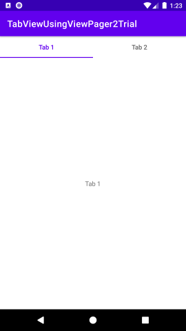
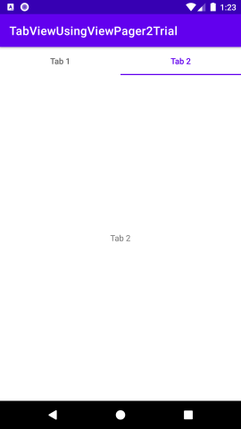

# TabViewUsingViewPager2Trial
ViewPager2を使用してタブビューを作成する方法の試行

## Screenshots : スクリーンショット
<kbd></kbd> <kbd></kbd>

## Requirements : 必要条件、依存関係
- Android Studio 2020.3.1 Patch3

## Author : 作者
Nobuki HIRAMINE : http://www.hiramine.com

## License : ライセンス
Copyright 2022 Nobuki HIRAMINE  
The source code is licensed under the Apache License, Version 2.0.  
See the [LICENSE](LICENSE) file for more details.  
(本アプリケーションのソースコードのライセンスは、「Apache License, Version 2.0」です。  
詳細は「[LICENSE](LICENSE)」ファイルを参照ください。)
